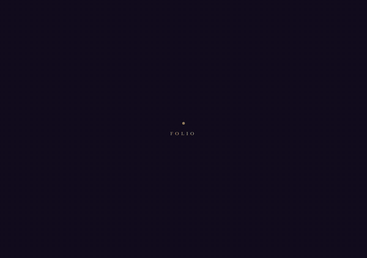
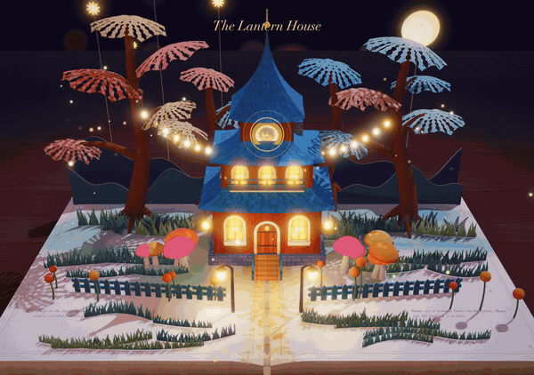
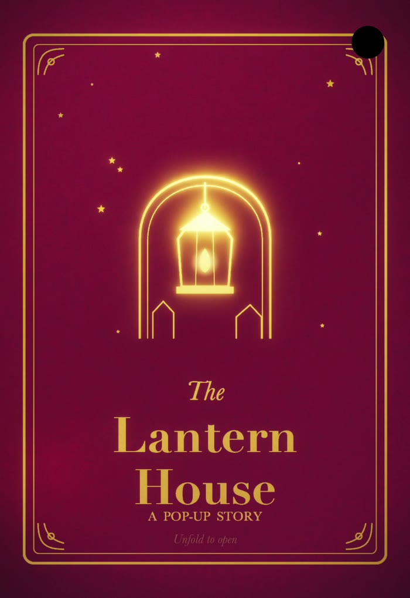
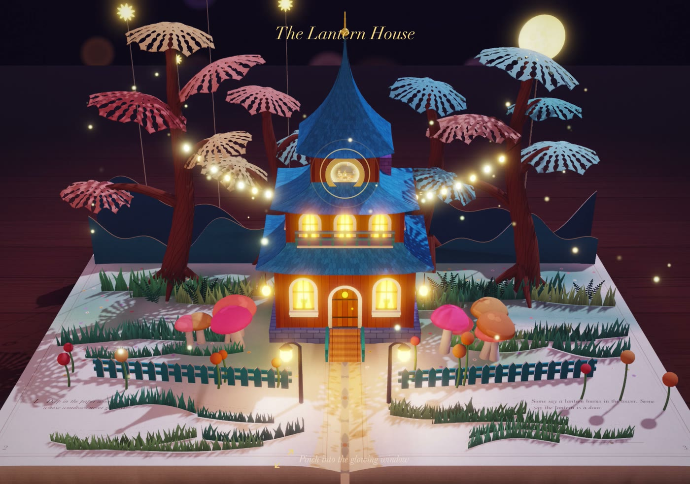
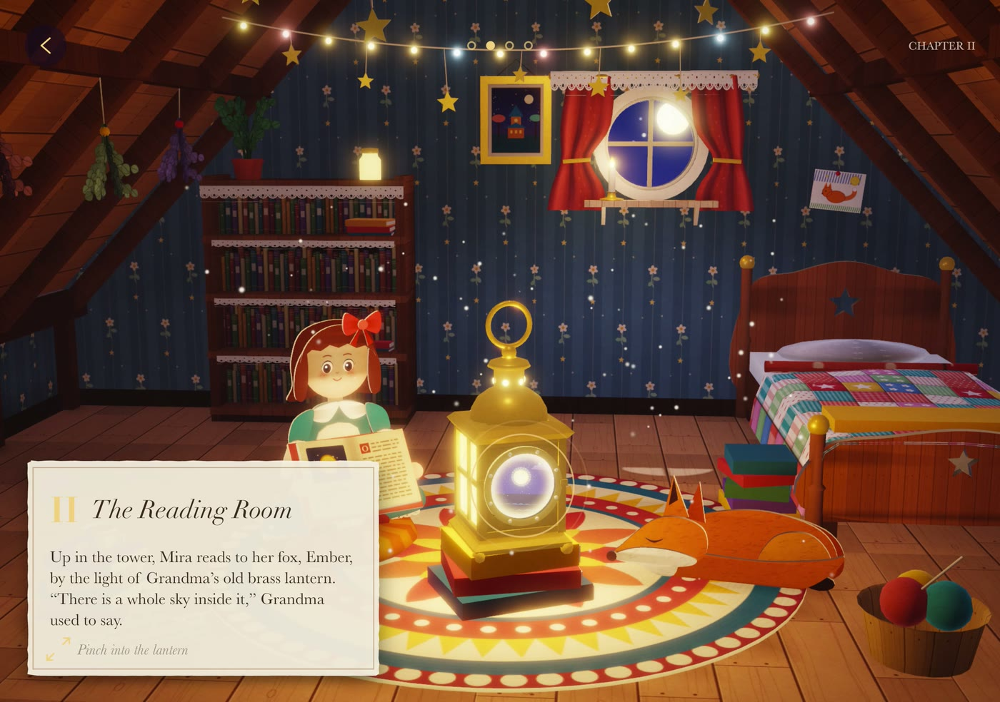
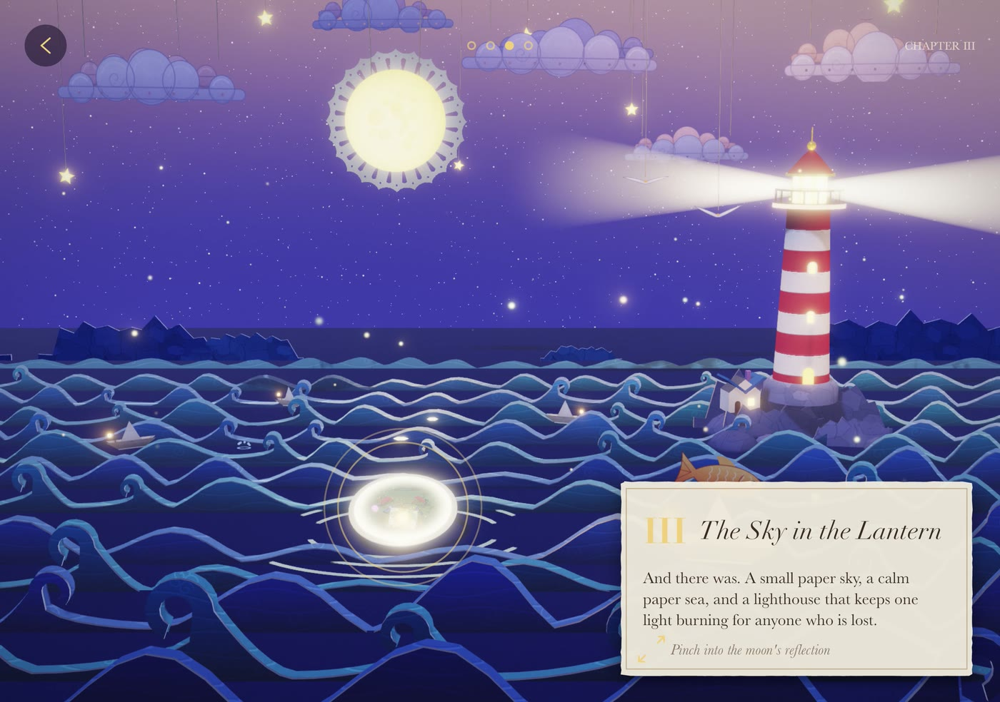
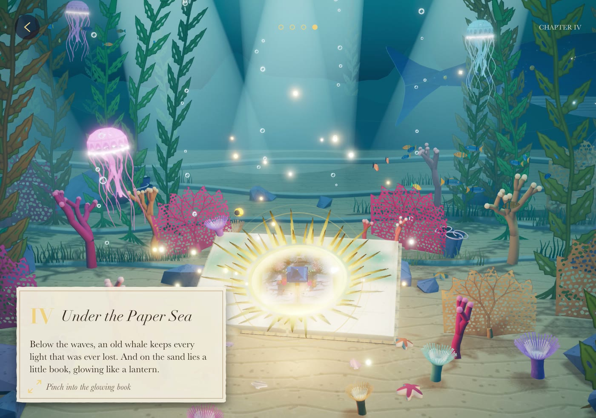
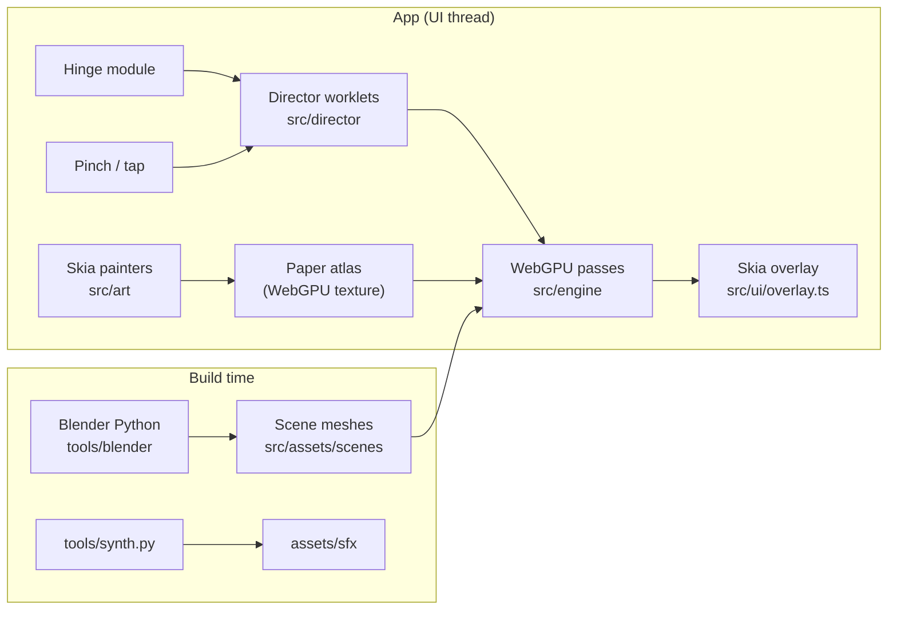

# Folio

**A pop-up storybook for the iPhone Duo, built with Expo, React Native Skia and WebGPU.**

Folded, the phone is the book: the cover display shows a closed, gold-foiled hardcover. Unfold it
and the book opens with the hinge while paper pieces spring up one by one. Pinch into the glowing
window and the camera dives through it into the next chapter, which becomes a normal app screen.
Every pinch goes one chapter deeper, and the last one leads back into the book.


| Unfold to open | Pinch to dive |
|---|---|
|  |  |

▶ **[Watch the full showreel (65 s)](media/showreel.mp4)**: cover, every chapter and the loop back into the book.

<table>
  <tr>
    <td rowspan="2" width="30%"></td>
    <td></td>
    <td></td>
  </tr>
  <tr>
    <td></td>
    <td></td>
  </tr>
</table>

## The story

1. **The Lantern House.** Deep in the paper woods stands a house whose windows never go dark.
2. **The Reading Room.** Up in the tower, Mira reads to her fox, Ember, by the light of Grandma's
   brass lantern. "There is a whole sky inside it."
3. **The Sky in the Lantern.** A paper sky, a calm paper sea, a lighthouse that keeps one light
   burning for anyone who is lost.
4. **Under the Paper Sea.** An old whale keeps every light that was ever lost, and on the sand lies a
   little book glowing like a lantern: the same book. Dive into it and the story starts again.

## What's inside

- **The hinge drives the book.** A small local Expo Module in Swift (`modules/folio-hinge`) streams
  `UIHingeInteraction` angles to JS, so the book opens exactly as far as the phone does. Folded,
  the cover display gets its own camera and a foil layer.
- **One GPU device for Skia and WebGPU.** `react-native-skia` 3 (Graphite on Dawn) and
  `react-native-webgpu` share the same Dawn device. Skia paints a 4096² paper atlas straight into a
  WebGPU texture (no copy), and the same Skia draws the app chrome on top of the 3D frame.
- **Scene inside a scene.** Each portal samples the next chapter, rendered in the same frame, so the
  dive is one continuous camera move instead of a cut.
- **A paper material.** Fibre grain, pale cut edges, translucent vellum, gold foil, lace cut-outs
  that cast lace shadows (soft PCF shadow maps), fireflies, bloom and per-chapter grading.
- **The director runs as worklets.** Hinge springs, pop-up springs with paper overshoot,
  pinch-scrubbed dives, cameras and actor animation all run on the UI thread with Reanimated.
- **Everything is generated by code.** The scenes are Blender Python, the art is Skia drawing code,
  and every sound (paper pops, page slides, the dive whoosh, a music-box lullaby, four ambiences) is
  synthesized by `tools/synth.py`. No third-party images or audio are used.
- **A headless renderer.** `tools/headless.ts` runs the real director and WGSL on Dawn in Node, with
  the atlas painted by the same Skia code on CanvasKit, so a frame can be rendered and compared
  pixel by pixel without a simulator.

## How it works



Each frame, `src/engine/render.ts` encodes the next chapter first (shadow pass, then the main pass
into its own HDR target), then the current chapter, whose portal samples that target. Bloom and a
composite with the chapter's grade follow, and Skia draws the chapter card, dots and back button over
the result.

## Getting started

Requirements: macOS with Xcode and the **iOS 27.1** simulator runtime (it has the iPhone Duo and
`UIHingeInteraction`), [bun](https://bun.sh) and CocoaPods. The generated scenes and sounds are
committed, so running the app needs nothing else. It uses native modules (Skia, WebGPU, the hinge),
so it runs as a development build, not in Expo Go.

```sh
git clone https://github.com/giaBaoJS/folio-popup-book.git
cd folio-popup-book
bun install
bunx expo prebuild --platform ios
bun run ios            # debug build with Metro (add --device to pick a simulator)
```

For smooth 60 fps use a Release build:

```sh
xcodebuild -workspace ios/Folio.xcworkspace -scheme Folio -configuration Release \
  -sdk iphonesimulator -destination 'id=<UDID>' -derivedDataPath ios/build/dd build
xcrun simctl install <UDID> ios/build/dd/Build/Products/Release-iphonesimulator/Folio.app
xcrun simctl launch <UDID> com.giabaojs.folio
```

Create an **iPhone Duo** simulator on iOS 27.1 and fold or unfold it from the Simulator's Device
menu (or DeviceHub). Without a hinge, tap the cover to open the book. Pinch into (or tap) the glowing portal to
dive, and use the back button to go up a chapter.

### Launch flags

Pass them after the bundle id, e.g. `xcrun simctl launch <UDID> com.giabaojs.folio -showreel 1`.

| Flag | Effect |
|---|---|
| `-showreel 1` | Autopilot through the whole story (used for the recordings) |
| `-chapter N` | Start inside chapter N, 0-based |
| `-mute 1`, `-nohaptics 1` | No sound, no haptics |
| `-debug 1` | Status line with timings and director state |
| `-atlas 1`, `-pattern <id>` | Draw the paper atlas, or one pattern of it |
| `-stage N` | Cut the pipeline to stage N: 1 composite, 2 + bloom, 3 + main pass, 4 + shadows, 5 + next chapter, 6 + particles |
| `-testclear 1` | Clear to red instead of rendering (GPU path check) |

## Project layout

```
src/
  director/   world.ts: the story director (fold, pop-ups, dive, cameras, uniforms); showreel.ts
  story/      one scene_*.ts per chapter (look, lights, cameras, text, animation), registry.ts,
              rig.ts (book + pop-up mechanics), anim.ts (actor helpers), looks.ts, types.ts
  engine/     shaders.ts (WGSL), gpu.ts (pipelines, targets), render.ts (passes), frame.ts, math.ts
  art/        the Skia-painted paper atlas: atlas.ts, brush.ts, paint_*.ts, patterns.json
  ui/         Stage.tsx (GPU setup, frame loop, gestures, hinge, audio), overlay.ts (app chrome)
  assets/     generated scene meshes (do not edit)
  audio.ts, flags.ts
App.tsx                the root component
assets/sfx/            generated sounds
media/                 README images and the showreel
modules/folio-hinge/   Expo Module (Swift) for UIHingeInteraction
plugins/               config plugin for the iOS 27 scene lifecycle
tools/
  blender/    the scene builder: kit.py (paper geometry), props.py, book.py, one file per chapter
  headless.ts the headless renderer; synth.py the sound synthesizer
  sheet.py    contact sheet of PNGs; rot.py rotates a Duo inner-panel screenshot to landscape
```

## Rebuilding the assets

This needs Blender 5.2 on PATH (`export PATH="/Applications/Blender.app/Contents/MacOS:$PATH"`),
python3 with `numpy` (and `Pillow` for `tools/sheet.py`), and Node for the headless renderer.

```sh
bun run scenes -- [--only woods,attic] [--no-preview]   # -> src/assets/scenes/*.ts
bun run sounds                                          # -> assets/sfx/*.wav
bun run headless -- --shot "woods,cover,woods:p=0.6,attic@4,deep:yaw=0.3"   # PNGs in .headless/
```

Both asset builds are deterministic. The headless renderer is macOS only (it loads system fonts).
[`tools/SCENE_GUIDE.md`](tools/SCENE_GUIDE.md) explains how a chapter is built: paper geometry,
portals, looks, painters and the shot syntax. [`AGENTS.md`](AGENTS.md) is a compact reference of
commands, layout and traps.

## Things learned the hard way

- **The iOS simulator has no comparison samplers.** A `sampler_comparison` in a bind group silently
  drops the whole command buffer, because Skia's Dawn device skips validation. Shadows here use
  `textureLoad` PCF instead.
- **Async WebGPU never settles** on the device imported from Skia (`mapAsync`, async pipeline
  creation). Create pipelines synchronously.
- **Out-of-bounds storage reads return garbage on device** (robustness is off) while Node Dawn clamps
  them, so a passing headless render does not prove a buffer index is in range.
- **Worklet closures are captured when the module evaluates.** A worklet that calls a helper declared
  later in the file gets `undefined`, and a helper without `'worklet'` crashes only on device.
- **WGSL derivatives** (`dpdx`, `fwidth`, implicit-LOD sampling) must run before any non-uniform
  branch or `discard`.

## Stack

Expo SDK 57 · React Native 0.86 · React 19.2 · `react-native-skia` 3.1.0 · `react-native-webgpu`
0.13.0 · `react-native-reanimated` 4.7.1 · `react-native-worklets` 0.13.0 · expo-audio ·
expo-haptics · Blender 5.2 (asset build only).

## License

[MIT](LICENSE). The story, art, geometry and sound are all original and generated by the code in
this repo. Text is set in iOS system fonts, which are not bundled.
